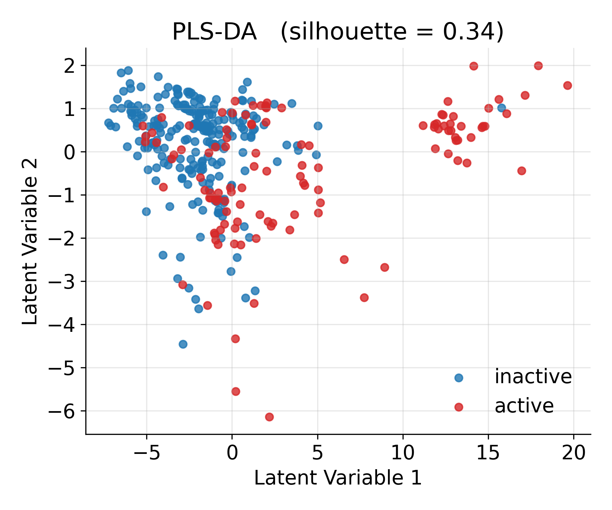
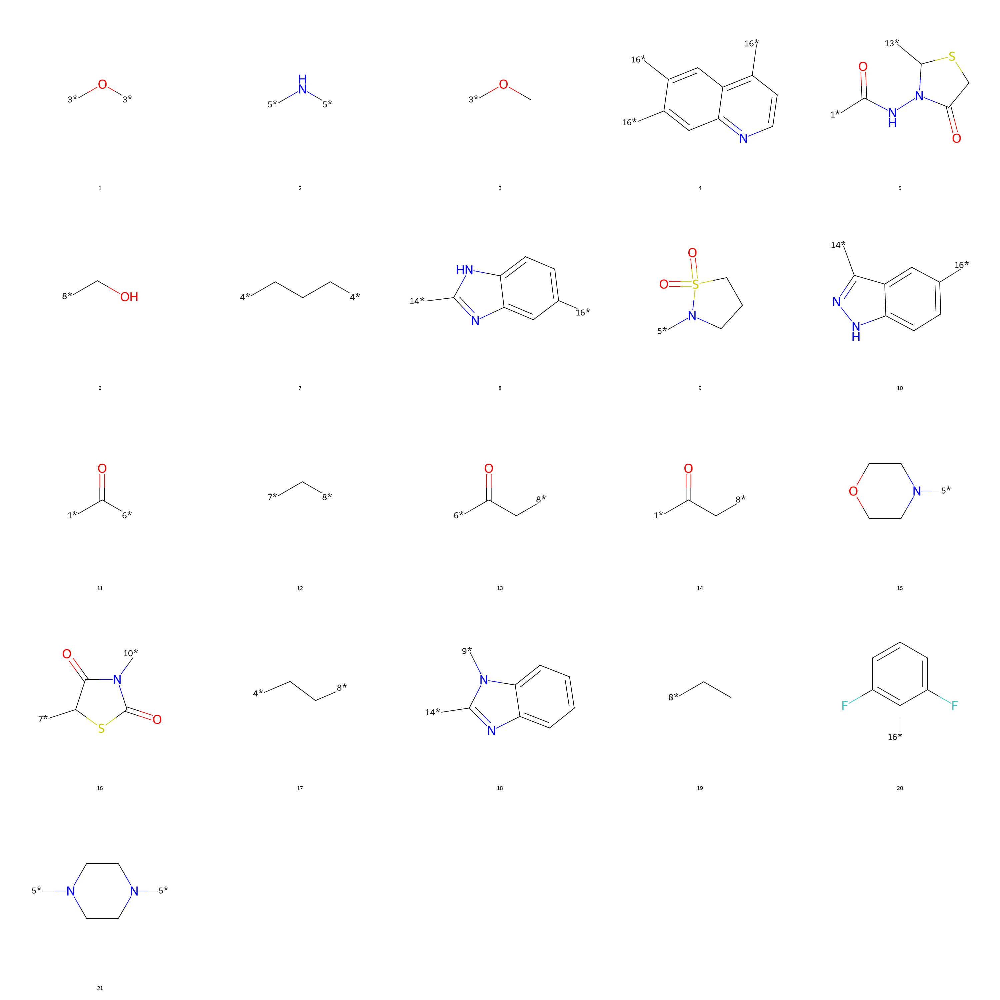
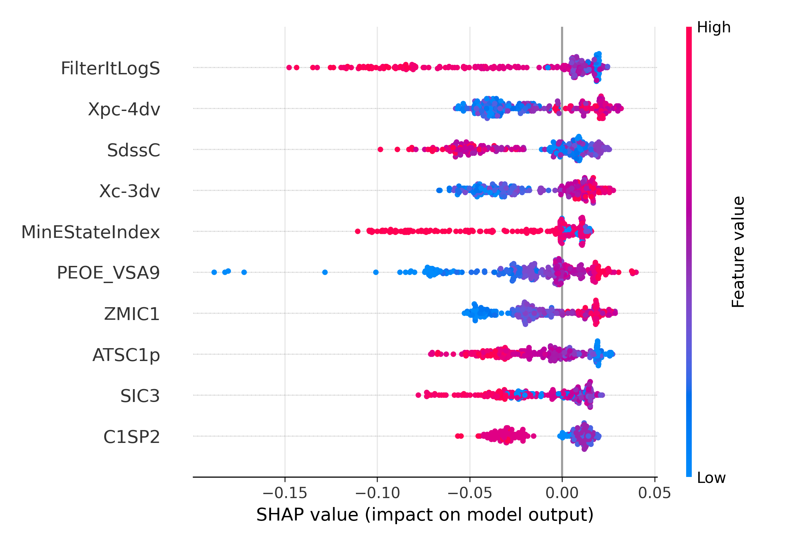
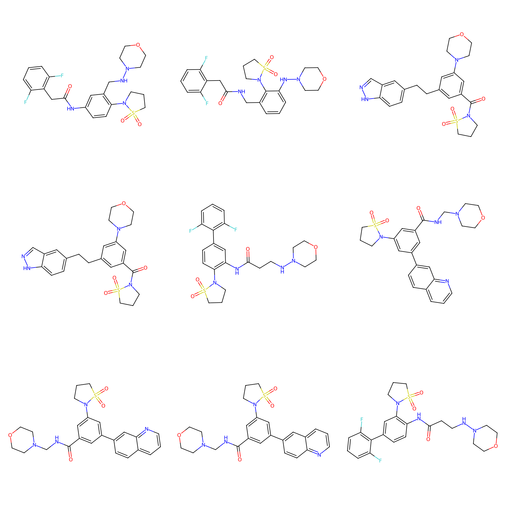

# Reverse-QSAR and Fragment-Driven Design for Anticancer Molecules

<br>[](#)<br>


---

## Table of Contents

1. [Overview](#overview)
2. [Key Features](#key-features)
3. [Getting Started](#gettingstarted)
4. [Project Structure](#projectstructure)
5. [Pipeline Steps](#pipelinesteps)
6. [Configuration](#configuration)
7. [Results](#results)
8. [License](#license)
9. [Contact](#contact)

---
> [!NOTE]
> * **Target flexibility** – Set any anticancer cell-line  of interest by simply putting the correct **ChEMBL ID** in the config (e.g. `CHEMBL614514` for MDA-MB-231).
> * **Custom chemical space** – The pipeline expects a **CSV with SMILES** of candidate molecules (`/your_molecules.csv`).  

> [!TIP]
> * use ChEMBL’s substructure search to export all compounds that contain your pharmacophore of choice and feed them straight into the workflow.
> * pipeline allows you to add `/my_compounds.csv` with molecules coming from your own resources.

## 📋 Overview

Design and evaluate new anticancer molecules with an **explainable Random Forest QSAR** model.  The workflow covers:

* Automatically pulls all compounds for a chosen ChEMBL target and merges them with your custom **chemical-space**
* Building **Reverse-QSAR** model to establish the most important fragments for compound's anticancer activity. 
<p align="center">


 
</p>


* Building classical balanced Random Forest QSAR model for predicting new compounds anticancer activity- based on Boruta selected Modred and 
Rdkit descriptors and SHAP interpretation.
* Designing new molecules using Island‑style Genetic Algorythm  that recombines BRICS fragments into new analogues and
chooses 100 the best hits for further analysis. 

<p align="center">


</p>

---

## 🔑 Key Features — one-glance summary

| Stage / Module      | Highlights (essentials)                                                                  |
|---------------------|------------------------------------------------------------------------------------------|
| **Data Curation**   | One-click ChEMBL pull → merge with your SMILES list · automatic sanitisation & deduplication |
| **Descriptors**     | 1 900 + RDKit + Mordred features · auto clean (∞/NaN, ρ > 0.9) · on-disk cache           |
| **Reverse-QSAR**    | Boruta-SHAP descriptor ranking · PLS-DA class check · fragment enrichment maps           |
| **RF-QSAR Model**   | Balanced RF (1 200 trees) · 500× bootstrap AUC ± CI · global & local SHAP plots          |
| **Fragment Analysis**| BRICS + SMARTS library · odds-ratio ranking · grid export (`.png`, `.sdf`)               |
| **Island GA Design**| 4 islands · fitness = 0.8·QSAR + 0.1·QED + 0.1·diversity · outputs **100 unique hits**    |
| **Outputs**         | Ready-to-dock /PDBQT · 600 dpi figures · TSV/CSV metrics                                 |
| **Reproducibility** | `environment.yml` lockfile · tagged release (`paper-v1.0`)              |

---

## Getting Started

### Prerequisites

* macOS 13+ / Linux
* Python 3.10 (Conda recommended)

```bash
  conda env create -n qsar-env -f environment.yml
  conda activate qsar-env
```


---

## Project Structure

```text
REFIDD/
│   
├─ REFIDD/
│   ├─ Data_preparation.py
│   ├─ Similarity.py
│   └─ results/
│       ├─ Evaluation_qsar_model/
│       ├─ Defragmentation_results/
│       └─ GA_Island_Hits/
├─ environment.yml
│ 
└─ README.md
```

---

## 🛠️ How to Run the Pipeline — step by step


| Step | Goal | Command (copy ⇣) | Key Outputs |
|------|------|------------------|-------------|
| **1. Data Preparation** | Sanitise SMILES, compute 2 D descriptors, store cache | ```bash<br>python Deskryptory/Data_preparation.py \ <br>       --input  data_sets/data/processed/final_dataset.csv \ <br>       --output results/Descriptors/X_full.pkl``` | `X_full.pkl` (descriptor matrix) |
| **2. QSAR Training** | Balanced RF + Boruta, 500× bootstrap | ```bash<br>python results/Evaluation_qsar_model/qsar_train.py``` | `rf_model.joblib`, `selected_descriptors.csv`, ROC / PR / calibration plots |
| **3. SHAP Analysis** | Global & local feature importance | *(already run in step 2; optional per-molecule waterfalls):*<br>```bash<br>python results/Evaluation_qsar_model/shap_explain.py \ <br>       --smiles "CCOC(=O)N..."``` | `shap_beeswarm_plot.png`, waterfalls |
| **4. Fragment Enrichment** | Rank fragments (odds ratio + SHAP) | ```bash<br>python defragmentation.py``` | Fragment grid + `selected_fragments.smi` |
| **5. Island GA Design** | Generate **100 unique hits** | ```bash<br>python new_compounds.py``` | `top100_hits.tsv`, `first_10_hits.png` |
| **6. Reporting** | Collect figures/tables for paper | *(example)*<br>```bash<br>mkdir -p paper_outputs && \ <br>cp results/Evaluation_qsar_model/plots/*.png        paper_outputs/ && \ <br>cp results/Defragmentation_results/*/plots/*.png    paper_outputs/ && \ <br>cp results/top_100_hits/first_10_hits.png           paper_outputs/ && \ <br>cp results/Evaluation_qsar_model/model_metrics/*.txt paper_outputs/``` | All manuscript-ready artefacts in `paper_outputs/` |

---

### ⚡ Quick one-liner

```bash
conda activate fraggen-100
python Deskryptory/Data_preparation.py && \
python results/Evaluation_qsar_model/qsar_train.py && \
python defragmentation.py && \
python new_compounds.py
```
---

## Results

Key outputs (under `results/`):

* `roc.png`, `pr.png` – performance metrics
* `shap_beeswarm.png`, `shap_bar.png` – descriptor impact
* `first_10_hits.png`, `top100_hits.tsv` – generated molecules

---

## License

Research‑only. For commercial use contact the author.

---

## Contact

**Tomasz Szostek** – PhD Candidate, University of Milano‑Bicocca
Email: [tomasz.szostek@example.com](mailto:tomasz.szostek@example.com)

---

*Happy modelling!*
