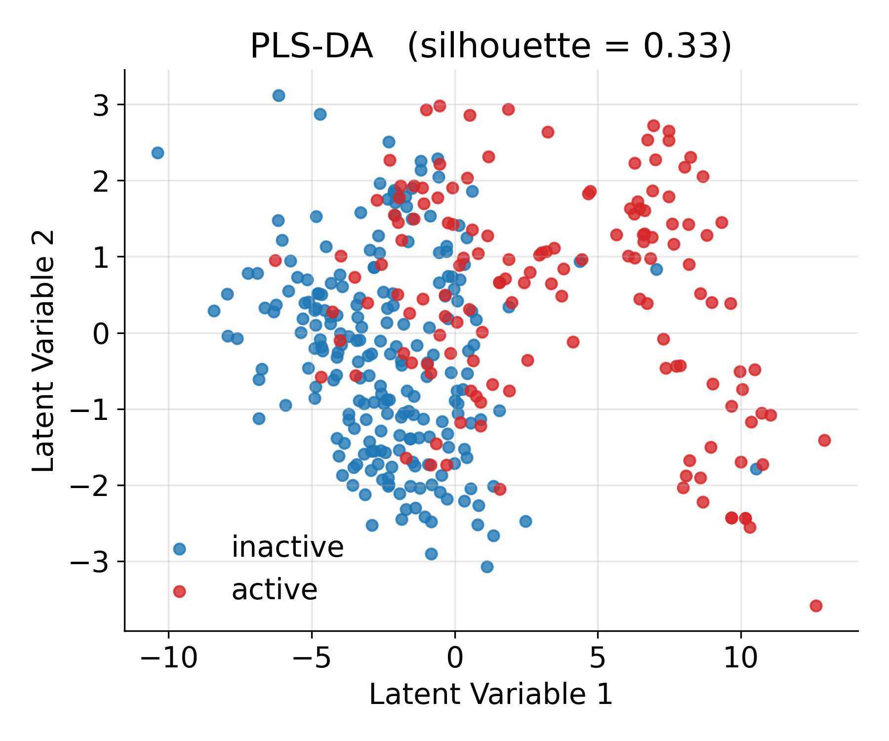
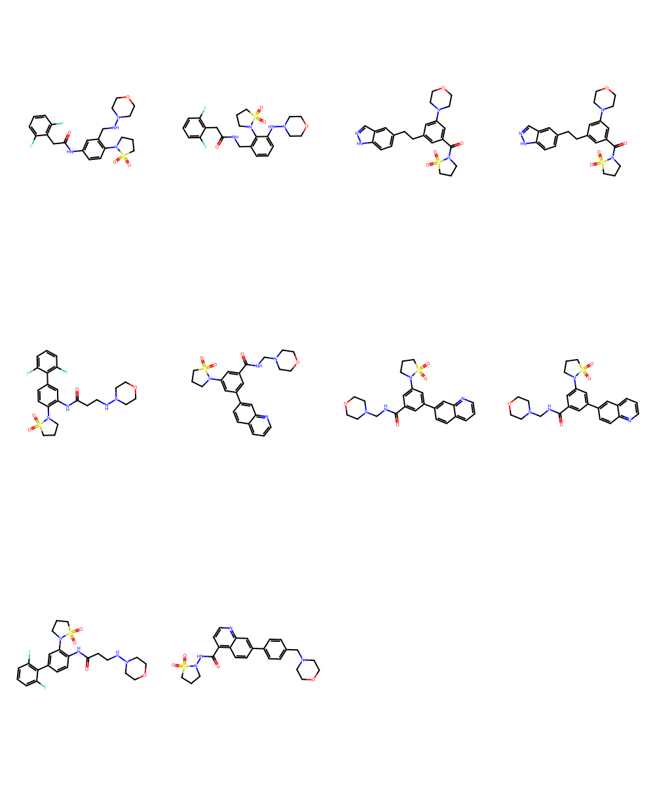

# Reverse-QSAR and Fragment-Driven Design for Anticancer Molecules

<br>[](#)<br>


---

## Table of Contents  
1. [📝 Overview](#-overview)  
2. [✨ Key Features](#-key-features)  
3. [🚀 Getting Started](#-getting-started)  
4. [📂 Project Structure](#-project-structure)  
5. [🏃🏻‍♂️💨 How to Run the Pipeline](#-how-to-run-the-pipeline)  
6. [📣 Citation](#citation)


---
> [!NOTE]
> * **Target flexibility** – Set any anticancer cell-line  of interest by simply putting the correct **ChEMBL ID** in the config (e.g. `CHEMBL614514` for MDA-MB-231).
> * **Custom chemical space** – The pipeline expects a **CSV with SMILES** of candidate molecules (`/your_molecules.csv`).  

> [!TIP]
> * use ChEMBL’s substructure search (or another chemical compounds database) to export all compounds that contain your pharmacophore of choice and feed them straight into the workflow.
> * pipeline allows you to add `/my_compounds.csv` with molecules coming from your own resources.

## 📝 Overview

Design and evaluate new anticancer molecules with an **explainable Random Forest QSAR** model.  The workflow covers:

* Automatically pulls all compounds for a chosen ChEMBL target and merges them with your custom **chemical-space**
* Building **Reverse-QSAR** model to establish the most important fragments for compound's anticancer activity. 
<p align="center">


 
</p>


* Building classical **Balanced Random Forest QSAR** model for predicting new compounds anticancer activity- based on Boruta selected Modred and 
Rdkit descriptors and SHAP interpretation.
* Designing new molecules using Island‑style Genetic Algorythm  that recombines BRICS fragments into new analogues and
chooses 100 the best hits for further analysis (assessed by QSAR activity prediciton, Quantitative Estimate of Druglikeness score, and passing Lipinski's rules).

<p align="center">


</p>

---

## ✨ Key Features

| Stage / Module      | Highlights (essentials)                                                                  |
|---------------------|------------------------------------------------------------------------------------------|
| **Data Curation**   | One-click ChEMBL pull → merge with your SMILES list · automatic sanitisation & deduplication |
| **Descriptors**     | 1 900 + RDKit + Mordred features · auto clean (∞/NaN, ρ > 0.9) · on-disk cache           |
| **Reverse-QSAR**    | Boruta-SHAP descriptor ranking · PLS-DA class check · fragment enrichment maps           |
| **RF-QSAR Model**   | Balanced RF (1 200 trees) · 500× bootstrap AUC ± CI · global & local SHAP plots          |
| **Fragment Analysis**| BRICS + SMARTS library · odds-ratio ranking · grid export (`.png`, `.sdf`)               |
| **Island GA Design**| 4 islands · fitness = 0.8·QSAR + 0.1·QED + 0.1·diversity · outputs **100 unique hits**    |
| **Outputs**         | Ready-to-dock /PDBQT · 600 dpi figures · TSV/CSV metrics                                 |
| **Reproducibility** | `environment.yml` lockfile · tagged release (`paper-v1.0`)              |

---

## 🚀 Getting Started

### Prerequisites

* macOS 13+ / Linux
* Python 3.10 (Conda recommended)


---

## 📂 Project Structure


```
REFIDD/
├── data/                              # raw chemistry data
│   ├── all_target_compounds/
│   │   └── A549_activities.csv        # ChEMBL IC50 values for the target
│   ├── chemical_space/
│   │   └── specific_compounds.csv     # public compounds that share a motif
│   ├── own_resources_compounds/
│   │   └── my_compounds.csv           # unpublished in-house molecules
│   ├── merged/                        # automatic merge of the three sources
│   │   └── merged.csv
│   └── processed/
│       └── final_dataset.csv          # QSAR-ready dataset (auto-generated)
│
├── results/                           # all artefacts are created here
│   ├── Evaluation_qsar_model/         # descriptors, model & diagnostics
│   │   ├── X_full.pkl
│   │   ├── selected_descriptors.csv
│   │   ├── rf_model.joblib            # Balanced-RandomForest
│   │   ├── rf.pkl                     # backup pickle
│   │   ├── plots/
│   │   │   ├── shap_bar_plot.png
│   │   │   ├── shap_beeswarm_plot.png
│   │   │   ├── roc.png
│   │   │   ├── pr.png
│   │   │   ├── calibration.png
│   │   │   ├── reliability.png
│   │   │   ├── proba_hist.png
│   │   │   └── confusion_matrix.png
│   │   └── model_metrics/
│   │       ├── bootstrap_stats.txt
│   │       ├── y_scramble.txt
│   │       └── cv_auc.txt
│   │
│   ├── Defragmentation_results/       # BRICS fragments
│   │   └── RandomForest/
│   │       └── selected_fragments.smi
│   │
│   ├── Similarity_visuals/            # PLS-DA scatter & violin plots
│   │   ├── pls_scores.csv
│   │   ├── plsda_stats.txt
│   │   ├── plsda_scatter.png
│   │   └── plsda_violin.png
│   │
│   └── GeneticIsland/                 # GA output
│       ├── fragments_library.csv
│       ├── top100_hits.tsv
│       └── first_10_hits.png
│
├── config.yml                         # single source of truth for every path,
│                                      # seed, hyper-parameter and GA setting
│
├── main.py                            # 🔥  one-liner to run the entire pipeline
│
├── data_preparation.py                # ETL and dataset assembly
├── defragmentation.py                 # fragment generation / selection
├── QSAR_model_evaluation.py           # Boruta + Balanced-RF + metrics
├── Similarity.py                      # PLS-DA visualisation
└── new_compounds.py                   # Genetic-Island GA (QSAR+QED+Diversity)
```

---

## 🏃🏻‍♂️💨 How to run the pipeline

1. **Create environment and install dependencies**

   ```bash
   conda env create -f environment.yml
   conda activate refidd          # or your own env name
   ```

   > RDKit (2023.09), Mordred, scikit-learn ≥1.4, imbalanced-learn,
   > BorutaPy, SHAP and tqdm are required. Everything is listed in
   > `environment.yml`.
---

2. **Adjust `config.yml` (optional)**  
> [!IMPORTANT]
> *Change target IDs, Chemical Space, paths, split ratios, Random-Forest size,
   GA hyper-parameters, … every knob is there.*

---

3. **Launch the entire workflow with one command**

   ```bash
   python main.py
   ```

   The script executes all five stages in order:

   | stage | module | artefacts produced |
   |-------|--------|--------------------|
   | Dataset build / merge | `data_preparation.py` | `data/processed/final_dataset.csv` |
   | BRICS fragment set    | `defragmentation.py`  | `results/Defragmentation_results/.../*.smi` |
   | QSAR modelling        | `QSAR_model_evaluation.py` | trained RF, SHAP plots, calibration, CV stats |
   | Active/inactive similarity visuals | `Similarity.py` | PLS-DA scatter, violin, stats |
   | Genetic-Island GA     | `new_compounds.py`     | `fragments_library.csv`, **`top100_hits.tsv`** (100 novel molecules), PNG grid |

---

4. **Output summary**

   After successful execution the log prints:

   ```
   🏁 Pipeline finished – 100 de-novo hits generated and ready for further optimisation.
   ```

   The TSV file `results/GeneticIsland/top100_hits.tsv` contains SMILES,
   fitness, QSAR probability, QED and diversity score for every new
   candidate; the first 10 molecules are visualised in
   `first_10_hits.png`. You can further look for the best candidates through molecular docking scoring (use https://github.com/TomaszSzostek/Molecular_docking.git).

---

## 📣 Citation

If you find this pipeline useful in your research, please cite:

```

  author  = Tomasz Szostek,
  title   = Molecular docking pipeline,
  year    = 2025,
  url     = https://github.com/TomaszSzostek/Molecular_docking.git

```
---

**Happy modelling & hit discovery!** 🎯
